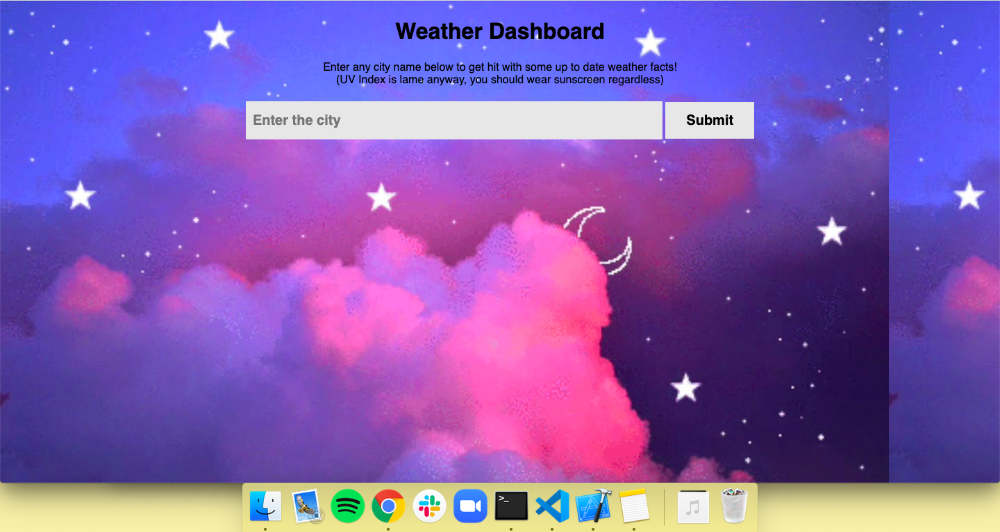
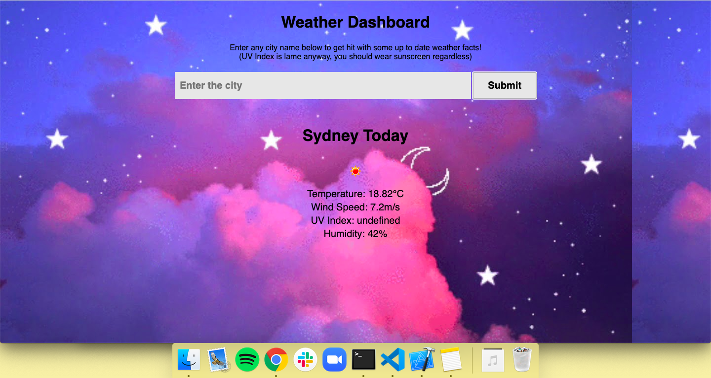

# Weather-Dashboard

Website Link: https://brandpower.github.io/Weather-Dashboard/

The Weather Dashboard allows you type in any city name in the world and will show you the temperature, an icon representing that temperature and the humidity. 

I also wanted to include a five day forecast however had trouble linking up that API to my javascript. I'm not sure why it was unresponsive, however this is something that, through collaboration and further experience, I will be able to solve. 

Below is an image of what the page looks like before you search the city name:

And this image shows the data that appears when searching the city name:

As you can see, the UV Index appears undefined. This is another issue that I ran into. I was able to access the webpage that the UV Index data was stored on however, I was unable to access the data. 
